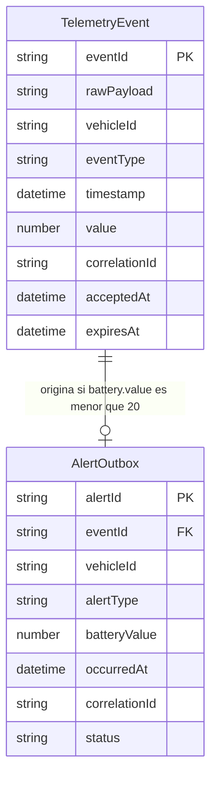

# Especificación funcional — telemetry-backend

## Alcance y decisiones

La unidad recibe `POST /telemetry-events`, publica en la cola de entrada, persiste telemetría de forma idempotente y produce alertas lógicas de batería baja mediante una salida duradera. Se aplican las respuestas 3A, 4B y 5A de `functional-design-questions.md`. `eventId` y `vehicleId` son cadenas no vacías; no se exige UUID. La cola de entrada es estándar. Una alerta puede entregarse físicamente más de una vez, siempre con el mismo `alertId`; el consumidor contractual deduplica por ese identificador.

## Flujos y estados — fuente de verdad

### F1. Aceptación HTTP

1. API Gateway solo permite `POST /telemetry-events` con clave de API válida y dentro de la tasa, ráfaga y cuota acordadas. Una ruta distinta no publica.
2. Validar los cinco campos obligatorios, identificadores no vacíos, `eventType` permitido, número finito y rango propio del tipo. `timestamp` debe ser ISO 8601 UTC y no superar en más de cinco minutos el reloj de aceptación. Un fallo devuelve `400` y no publica.
3. Fijar una sola vez `acceptedAt` en UTC y el `correlationId` efectivo. Transportar el cuerpo HTTP original como `rawPayload`, junto con los campos validados y ambos metadatos, en el mensaje de entrada.
4. Publicar en SQS de entrada. Solo tras confirmación responder `202` con `{"status":"accepted","msg_id":"<X-Correlation-Id>","acceptedAt":"<UTC>"}`. Un fallo o resultado incierto devuelve una respuesta no exitosa y registra la correlación. La respuesta no afirma que DynamoDB ya esté actualizado.

### F2. Persistencia e idempotencia

1. Lambda procesa cada mensaje y conserva el `rawPayload` original. Usa `eventId` como clave de partición del registro de evento; la comparación canónica para idempotencia considera los campos validados, no metadatos variables de transporte.
2. Para un `eventId` nuevo, calcular `expiresAt = acceptedAt + 90 días`. Si el tipo es `battery` y `value < 20`, derivar `alertId` de `eventId` y `eventType` y crear evento y salida `PENDING` en una transacción. Para los demás tipos y `battery.value >= 20`, crear solo el evento con escritura condicional.
3. Si otro mensaje del mismo `eventId` compite, la primera escritura gana. Un duplicado canónicamente idéntico no sobrescribe el evento ni modifica una salida existente, incluso si sigue `PENDING`.
4. Si el mismo `eventId` trae contenido canónico distinto, conservar el primer evento y la salida; registrar `IDEMPOTENCY_CONFLICT`, correlación y métrica. Tratar el mensaje como fallido según la política de reintentos, sin mutación parcial.
5. Informar fallos parciales del lote para que reaparezcan solo los mensajes fallidos. Tras la quinta recepción fallida, SQS los deriva a DLQ. Registrar causa, correlación, `eventId` disponible y contador sin secretos.

### F3. Publicación de alerta

1. El publicador obtiene salidas `PENDING` y construye `{alertId,eventId,vehicleId,alertType,batteryValue,occurredAt}`; `alertType` vale `LOW_BATTERY`, `occurredAt` es el `timestamp` UTC original y `correlationId` viaja como atributo.
2. Publicar en SQS de alertas. Si la publicación falla o es incierta, conservar `PENDING` y reintentar con el mismo `alertId`. Una publicación aceptada seguida de respuesta perdida puede producir otra entrega física.
3. Después de una confirmación satisfactoria, efectuar la transición condicional `PENDING → PUBLISHED`. Si falla esta actualización, reintentar sin cambiar la identidad lógica.
4. El contrato de consumo exige deduplicación por `alertId`. La prueba de conformidad verifica un único efecto lógico aun con reentregas. El orden cronológico de eventos de un mismo vehículo no modifica la evaluación independiente de cada evento.

### F4. Redrive y operación

1. Antes de redrive de DLQ, mostrar alcance permitido, cantidad, velocidad y destino; rechazar actor no autorizado o alcance vacío.
2. Tras confirmación autorizada, informar avance y resultados por lote, incluidos fallos parciales. Conservar evidencia suficiente para reanudar sin asumir éxito total. Una redrive repetida sigue F2 y F3.
3. Correlacionar solicitudes, mensajes, registros y alertas; medir tasa y latencia de aceptación, tiempo hasta persistencia, errores, edad/profundidad de colas, salidas pendientes y TTL elegible. Los umbrales, ventanas y destinos de alarma se fijan en el diseño de infraestructura.

## Transiciones de estado

| Entidad | Estado previo | Evento | Estado siguiente | Invariante |
|---|---|---|---|---|
| TelemetryEvent | ausente | escritura condicional válida | persistido | Una sola fila por `eventId`. |
| TelemetryEvent | persistido | duplicado idéntico | persistido | Cuerpo y metadatos originales inmutables. |
| TelemetryEvent | persistido | contenido diferente | persistido | Conflicto registrado, sin sobrescritura. |
| AlertOutbox | ausente | transacción de batería baja | PENDING | Evento y salida existen juntos. |
| AlertOutbox | PENDING | fallo o incertidumbre de SQS | PENDING | Mismo `alertId`. |
| AlertOutbox | PENDING | SQS confirma y actualización condicional | PUBLISHED | Mismo `alertId`. |
| AlertOutbox | PUBLISHED | duplicado o reintento | PUBLISHED | No se crea otra alerta lógica. |

## Diagrama entidad-relación — vista derivada de entities.md

Texto alternativo: cada evento persistido tiene cero o una salida de alerta; una salida pertenece exactamente a un evento.

## Resumen de reglas — vista derivada de rules.md

- BR1.1–BR1.7: ruta, acceso, validación, límites y respuesta de aceptación.
- BR2.1–BR2.5: idempotencia, contenido original, retención y atomicidad de la salida.
- BR3.1–BR3.4: umbral estricto, identidad lógica y publicación recuperable.
- BR4.1–BR4.3: fallos parciales, DLQ y redrive seguro.
- BR5.1–BR6.2: objetivos operativos, seguridad, auditoría y entrega.
