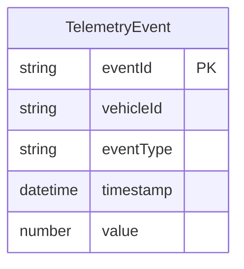

# Functional Specification

## Workflows and State Machines

1. **Ingestion Workflow**:
   - The API Gateway receives a telemetry payload via REST API POST request.
   - If the payload is invalid, the API rejects it with HTTP 400.
   - If valid, the API places the payload into the Input SQS queue.
   - The API immediately responds with HTTP 202 and a payload: `{"status": "accepted", "msg_id": "<X-Correlation-Id>"}`.

2. **Processing Workflow**:
   - A Lambda function consumes messages from the Input SQS queue.
   - The Lambda parses the `TelemetryEvent`.
   - The Lambda inserts a record into DynamoDB. The `eventId` is used as the Partition Key (PK).
   - If the event is of type "battery" and the value is less than 20, the Lambda publishes an alert message to the Alerts SQS queue.

## Entity-Relationship Diagram

## Rules Summary
- **BR1.1**: Battery alerts (IF eventType is 'battery' AND value < 20 THEN generate alert)
- **BR1.2**: DynamoDB Partition Key (use eventId as PK)
- **BR1.3**: HTTP 202 Response Format (return HTTP 202 with payload {"status": "accepted", "msg_id": "<X-Correlation-Id>"})
