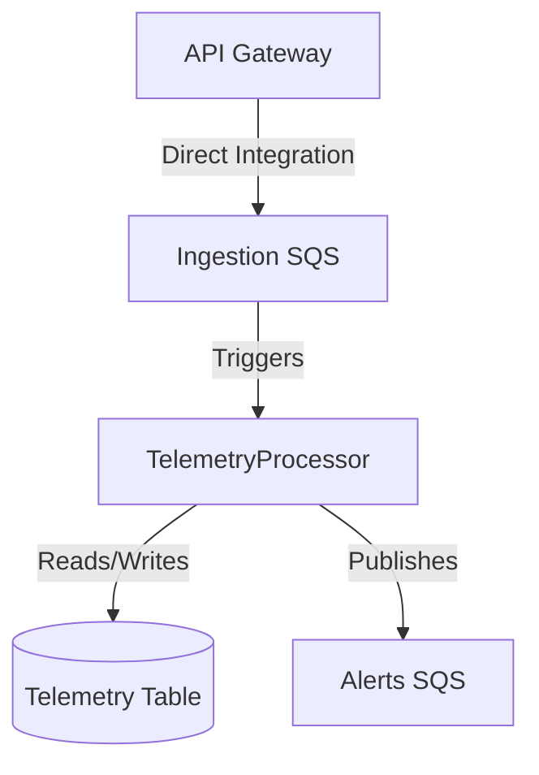

# Domain Design: Component Catalogue

```yaml
components:
  - name: TelemetryProcessor
    summary: Process incoming telemetry events from SQS, enforce limits, persist to DynamoDB, and emit battery alerts
    behaviour: >
      Validates telemetry payloads (BVA constraints like battery 0-100, speed 0-300).
      Enforces idempotency by checking DynamoDB before processing.
      Calculates TTL (acceptedAt + 90 days).
      Persists the valid event to DynamoDB.
      Evaluates battery rule (value < 20); if triggered, publishes to Alerts SQS with deduplication ID.
    responsibilities:
      - Telemetry event validation and persistence
      - Idempotency enforcement
      - Battery alert generation
    depends_on: []
    dependents: []
    external_dependencies:
      - name: API Gateway
        kind: api-gateway
        purpose: Direct integration to enqueue events
      - name: Ingestion SQS
        kind: queue
        purpose: Buffers incoming telemetry events
      - name: Telemetry Table (DynamoDB)
        kind: database
        purpose: Durable storage for telemetry events
      - name: Alerts SQS
        kind: queue
        purpose: Output destination for battery alerts
    entities:
      - name: TelemetryEvent
        identifier: eventId
        attributes: [vehicleId, eventType, timestamp, value, acceptedAt, expiresAt]
      - name: BatteryAlert
        identifier: alertId
        attributes: [eventId, vehicleId, timestamp, batteryLevel]
```

## Component Diagram



## Component Summary

| Component | Purpose | Depends On | Dependents | Entities Owned |
|---|---|---|---|---|
| TelemetryProcessor | Process telemetry, enforce limits, persist, and emit alerts | None | None | TelemetryEvent, BatteryAlert |

## Entity Ownership

| Entity | Owning Component | Identifier | Attributes | References |
|---|---|---|---|---|
| TelemetryEvent | TelemetryProcessor | `eventId` | `vehicleId`, `eventType`, `timestamp`, `value`, `acceptedAt`, `expiresAt` | None |
| BatteryAlert | TelemetryProcessor | `alertId` | `eventId`, `vehicleId`, `timestamp`, `batteryLevel` | None |

## External Dependencies

| Component | Dependency | Kind | Purpose |
|---|---|---|---|
| TelemetryProcessor | API Gateway | api-gateway | Direct integration to enqueue events |
| TelemetryProcessor | Ingestion SQS | queue | Buffers incoming telemetry events |
| TelemetryProcessor | Telemetry Table (DynamoDB) | database | Durable storage for telemetry events |
| TelemetryProcessor | Alerts SQS | queue | Output destination for battery alerts |

## Rationale

| Component | Rationale |
|---|---|
| TelemetryProcessor | La funcionalidad principal es una única canalización de datos: leer de la cola, validar, guardar en base de datos y generar alertas si es necesario. Al agrupar esta lógica en un único componente (`TelemetryProcessor`), se simplifica el despliegue y se evita el exceso de sobrecarga en la red. **Alternatives Rejected:** Se rechazó crear una Lambda separada para la validación (API) y otra para alertas, ya que esto añadiría latencia y puntos de fallo innecesarios para el volumen de carga esperado (Option A & A seleccionadas). |
