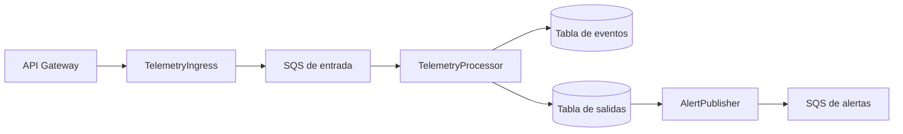

# Domain Design: Component Catalogue

```yaml
components:
  - name: TelemetryIngress
    summary: Valida solicitudes HTTP y publica eventos aceptados en SQS.
    behaviour: >
      Comprueba clave API en el borde, esquema, rangos y reloj; fija acceptedAt
      y correlationId; conserva rawPayload y responde 202 solo tras confirmar SQS.
    responsibilities:
      - Validación y aceptación HTTP
      - Propagación de payload crudo y metadatos
    depends_on: []
    external_dependencies:
      - name: API Gateway
        kind: api-gateway
        purpose: Ruta POST /telemetry-events y límites por clave.
      - name: Ingestion SQS
        kind: queue
        purpose: Publicación asíncrona confirmada.
    entities: []
  - name: TelemetryProcessor
    summary: Consume telemetría y persiste evento y salida de alerta atómicamente.
    behaviour: >
      Aplica idempotencia por eventId, conserva rawPayload y acceptedAt,
      calcula expiresAt y crea una salida PENDING si battery.value es menor que 20.
    responsibilities:
      - Persistencia condicional de eventos
      - Creación transaccional de salidas
      - Fallos parciales y DLQ
    depends_on: []
    external_dependencies:
      - name: Ingestion SQS
        kind: queue
        purpose: Fuente de eventos.
      - name: Telemetry Table
        kind: database
        purpose: Eventos y retención.
      - name: Alert Outbox Table
        kind: database
        purpose: Salidas duraderas.
    entities:
      - name: TelemetryEvent
        identifier: eventId
        attributes: [rawPayload, vehicleId, eventType, timestamp, value, correlationId, acceptedAt, expiresAt]
      - name: AlertOutbox
        identifier: alertId
        attributes: [eventId, vehicleId, alertType, batteryValue, occurredAt, correlationId, status]
  - name: AlertPublisher
    summary: Publica salidas pendientes y confirma su estado.
    behaviour: >
      Lee salidas PENDING, publica en SQS con alertId estable y marca PUBLISHED
      solo tras confirmación; recupera pendientes tras fallos.
    responsibilities:
      - Publicación recuperable
      - Transición condicional de estado
    depends_on: [TelemetryProcessor]
    external_dependencies:
      - name: Alert Outbox Table
        kind: database
        purpose: Lectura y actualización de salidas.
      - name: Alerts SQS
        kind: queue
        purpose: Entrega con deduplicación lógica por el consumidor.
    entities: []
```

## Component Diagram



Texto alternativo: el ingreso valida y encola; el procesador persiste el evento y, cuando corresponde, la salida; el publicador entrega alertas pendientes.

## Component Summary

| Component | Purpose | Depends On | Entities Owned |
|---|---|---|---|
| TelemetryIngress | Validar y encolar solicitudes HTTP. | Ningún componente propio. | Ninguna. |
| TelemetryProcessor | Persistir eventos y salidas atómicas. | SQS de entrada. | TelemetryEvent, AlertOutbox. |
| AlertPublisher | Publicar y recuperar salidas pendientes. | Salida creada por TelemetryProcessor. | Ninguna. |

## Entity Ownership

| Entity | Owning Component | Identifier | References |
|---|---|---|---|
| TelemetryEvent | TelemetryProcessor | eventId | Ninguna. |
| AlertOutbox | TelemetryProcessor | alertId | TelemetryEvent.eventId. |

## Rationale

La validación dependiente del reloj y del tipo de evento necesita lógica ejecutable antes de SQS; por eso el ingreso usa Lambda detrás de API Gateway. La salida duradera separa la transacción de DynamoDB de la publicación SQS y admite reentregas físicas sin perder la única alerta lógica.
